[![License][s1]][li]

[s1]: https://img.shields.io/badge/licence-GPL%203.0-blue.svg
[li]: https://raw.githubusercontent.com/matt77hias/IncisorSegmentation/master/LICENSE.txt

# Incisor Segmentation

Course Computer Vision: a model-based procedure capable of segmenting the incisors in panoramic dental radiographs using an Active Shape Model (ASM) at multiple resolutions. 

**Team**:
* [Matthias Moulin](https://github.com/matt77hias) (Computer Science)
* [Milan Samyn](https://github.com/MilanSamyn) (Computer Science)

**Academic Year**: 2013-2014 (2nd semester - 1st Master of Science in Engineering: Computer Science)

## About
The goal of the final project for the course Computer Vision is the development of a model-based procedure capable of segmenting the upper and lower incisor teeth in panoramic dental radiographs. To achieve this, an [Active Shape Model](https://en.wikipedia.org/wiki/Active_shape_model) (ASM) is constructed for each of the eight incisors. An Active Shape Model is a statistical model with the shape of a certain object that will be deformed during an iterative process to fit an instance of such an object in a different image.

### Input Landmarks
#### Image coordinate space

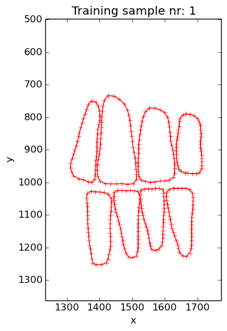
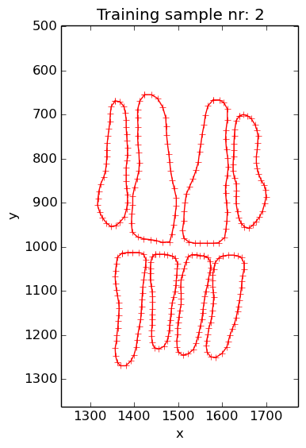
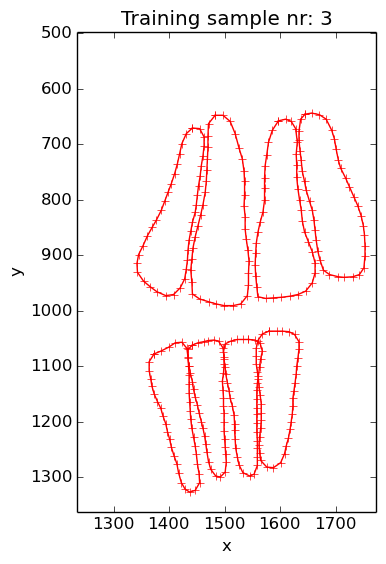
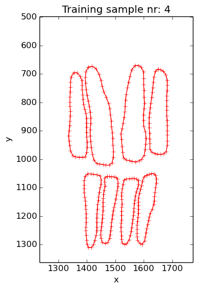

### Active Shape Model construction
We construct an [Active Shape Model](https://en.wikipedia.org/wiki/Active_shape_model) (ASM) for each of the eight incisors. Possible alternatives are:
* One model for modelling each of the eight incisors separately. Based on the landmarks, we do not prefer this approach due to the clear differences between the shape of the upper and lower teeth, and between the side and fore teeth.
* Multiple models for modelling one or more incisors separately.
* One model for modelling all eight incisors as a whole. Based on the landmarks, we do not prefer this approach due to the clear differences in distances between the upper and lower teeth.
* Multiple models for modelling one or more incisors as a whole. By constructing models for multiple incisors as a whole, possible correlations can be taken into account and exploited (e.g. neighbouring teeth influencing each other's position). This can be beneficiary and exploited during the fitting procedure. 
* Combinations of the aforementioned alternatives.

We chose to model each of the eight incisors separately (i.e. one model for each incisor), because this is the most general approach. The difficulty with this approach is deciding on the initial solution for the iterative fitting procedure. Given a 'well chosen' initial solution, the fitting procedure should not encounter any problems due to this approach.

The first subsection describes the normalization of all the tooth shapes (described by the given landmarks) of the training samples for the same incisor tooth via a [Procrustes Analysis](https://en.wikipedia.org/wiki/Procrustes_analysis). Next, the shape variance is analysed via a [Principal Component Analysis](https://en.wikipedia.org/wiki/Principal_component_analysis). Note that the models, constructed in these two subsections, only describe the shape variance and not the appearance variance. The appearance will be taken into account during the construction of the fitting functions and the iterative fitting procedure.

#### Procrustes Analysis
Before generating an Active Shape Model, each tooth shape (described by its landmarks) of the set of training samples belonging to the same tooth, needs to be aligned in a common coordinate system. First, we remove the 2D translation component by centring each tooth shape's centre of gravity at the origin. Second, we use a Procrustes Analysis to align (1D scalar and 1D rotation component) each tooth shape of the set of training samples belonging to same tooth, in such a way that the sum of the distances between the aligned tooth shape and the mean aligned tooth shape is minimized. [[Cootes95](https://github.com/matt77hias/IncisorSegmentation/blob/master/meta/Literature/T.%20Cootes_Active%20Shape%20Models_Their%20Training%20and%20Application.pdf)], [[Cootes00](https://github.com/matt77hias/IncisorSegmentation/blob/master/meta/Literature/T.%20Cootes_An%20Introduction%20to%20Active%20Shape%20Models.pdf)]

This is an iterative process. In each iteration step the mean aligned tooth shape is recalculated until the difference between two consecutive mean aligned tooth shapes in each dimension is smaller than a threshold value of 10-5. Initially, we used a larger value, but since convergence was reached after one or two iteration steps, we prefer a smaller value (i.e. more precision). With a threshold value of 10-5, convergence is reached after three iteration steps on average.

The resulting tooth models and tooth model landmarks are visualized below for each of the eight incisors, together with the landmarks of 14 training samples, in the same model coordinate space *(x', y')*. Note that the reference shape for aligning with regard to the scaling and rotation component, can be chosen arbitrarily. We chose to align with each of the eight tooth shapes of training sample 1.

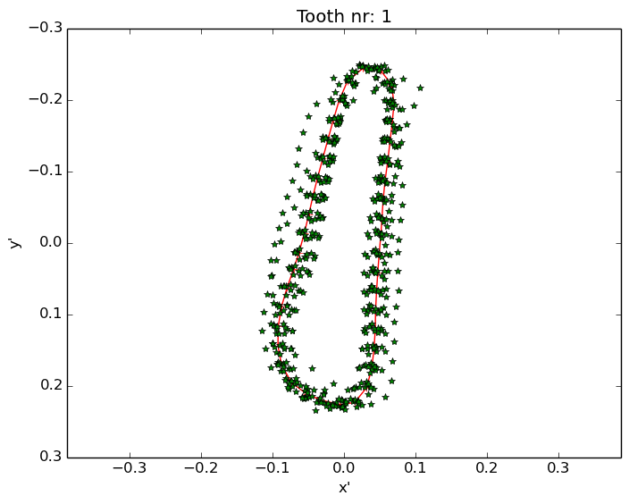
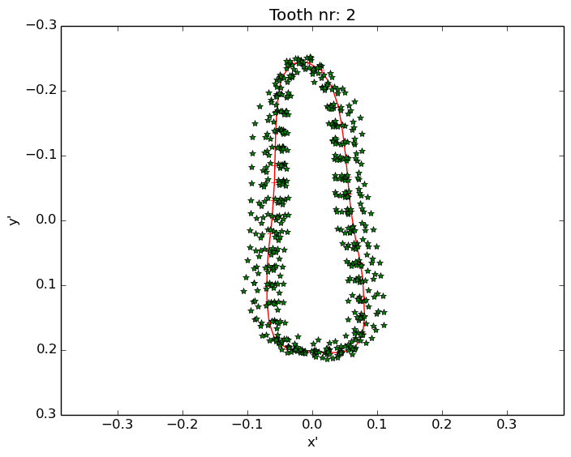
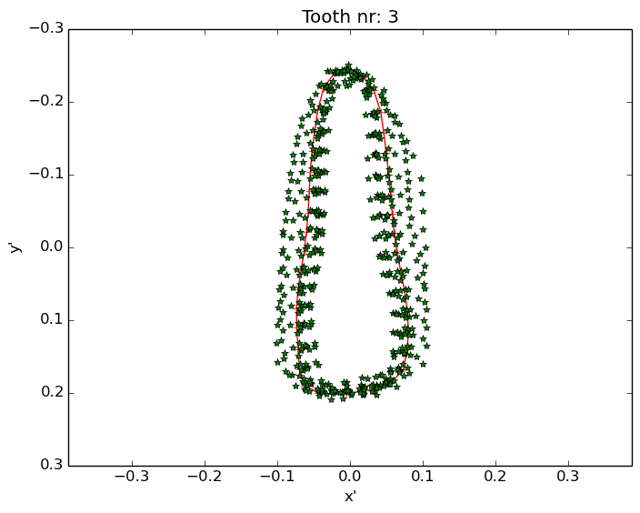
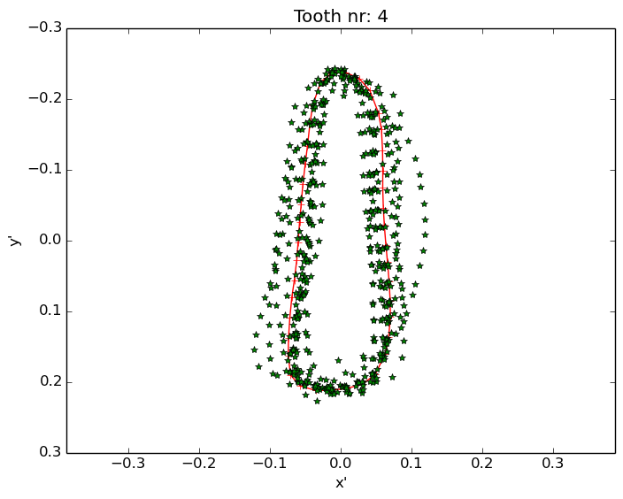

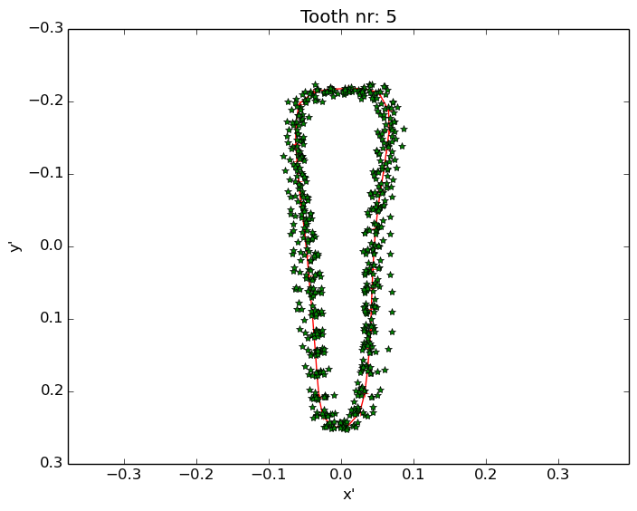
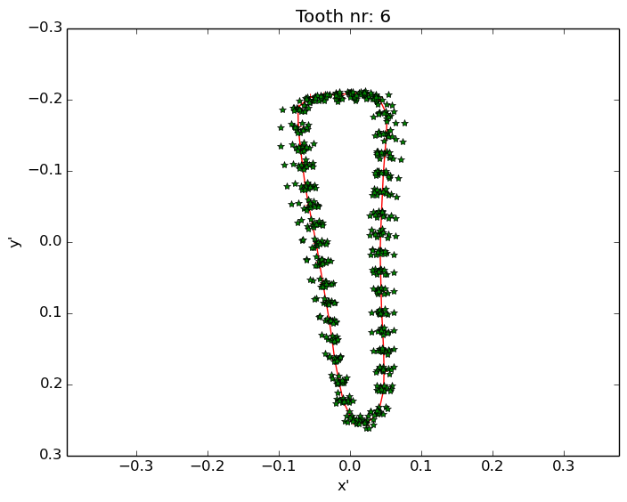
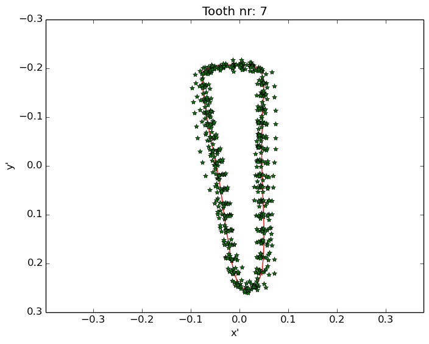
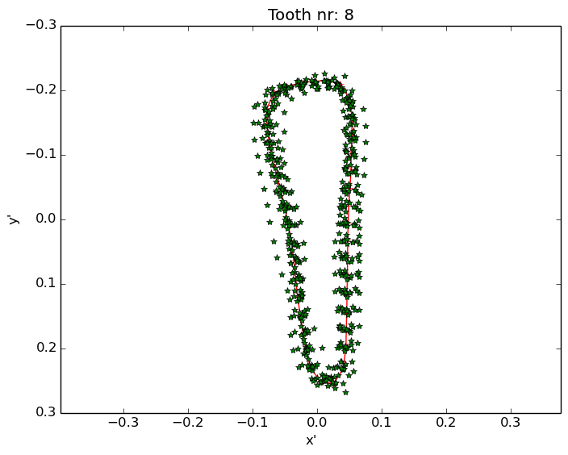

#### Principal Component Analysis
After the Procrustes Analysis, we have one model tooth for each of the eight incisor teeth in model coordinate space *(x', y')*. Each of these models is representative for the average shape of the corresponding incisor teeth. The aligned tooth shapes constitute a distribution in the *2n* dimensional space (with *n* the number of 2D landmarks). Our goal is to model this distribution.

We can for example use a basis for the *2n* dimensional space to represent each vector in this space as a *2n* dimensional coefficient vector (*2n* form factors). By applying a Principal Component Analysis (PCA), we can try to reduce the dimensionality by computing the principal axes (of which the magnitude is determined by the largest eigenvalues of the covariance matrix) of the distribution in order to express vectors approximately in this *2n* dimensional space with less form factors.

Based on the results of the Principal Component Analysis, it suffices to use for each of the eight incisors only 5, 6 or 7 form factors (versus *2n* = 40) to describe at least 98% of the variance of the landmark positions in the training set with regard to the corresponding mean model tooth. Alternatively, one can choose the form factors in such a way that each training sample can be represented with a certain accuracy.

By varying the form factors, we can vary the shape of the tooth. We need to determine upper and lower bounds for these variations in order to ensure the obtained teeth are still plausible. We allow +-3 standard deviations (*+-3 sqrt(γi)*) from the mean model tooth. The effect of *-3 sqrt(γi), -2 sqrt(γi), -1 sqrt(γi), 0, +1 sqrt(γi), +2 sqrt(γi), +3 sqrt(γi)* deviations on each form factor as opposed to the mean tooth model for each of the eight incisors in model coordinate space *(x', y')*, is visualized below.

##### (reduced) model coordinate space tooth 1

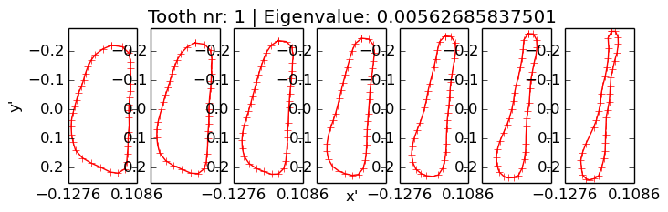
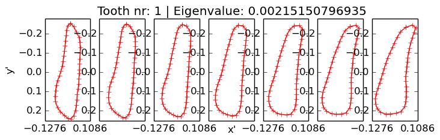
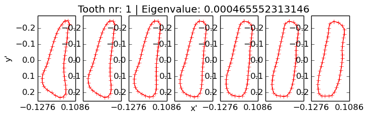

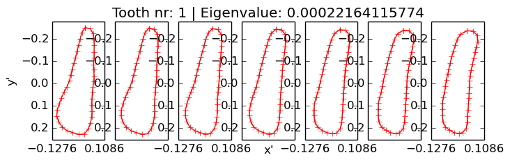
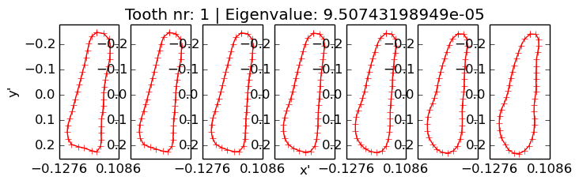
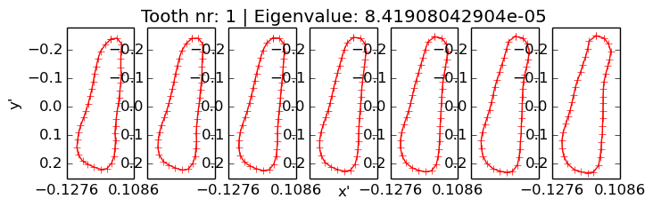

##### (reduced) model coordinate space tooth 2

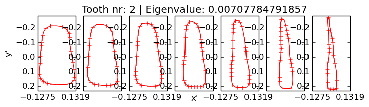
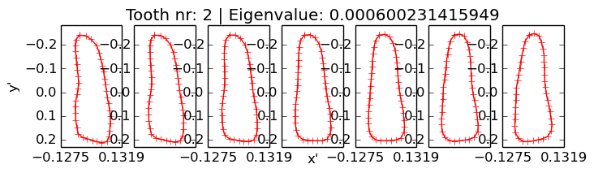

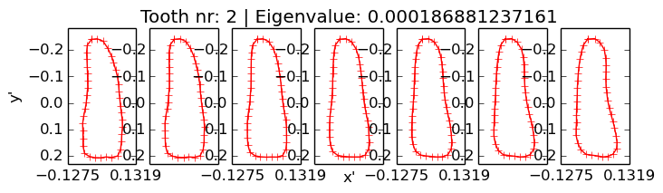
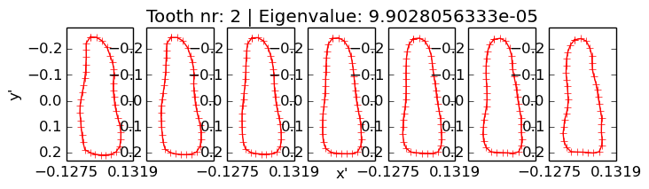
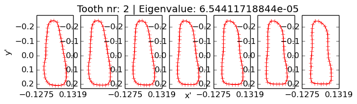

##### (reduced) model coordinate space tooth 3

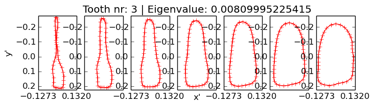
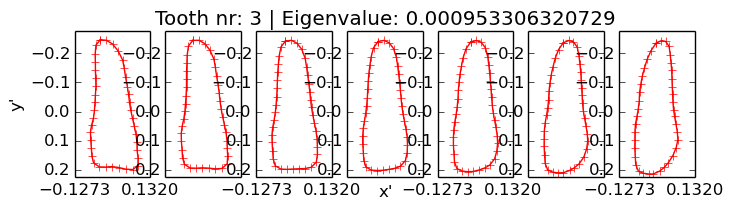

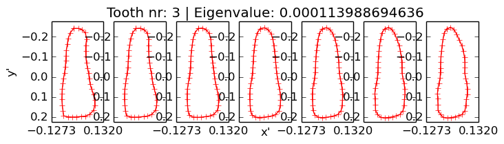
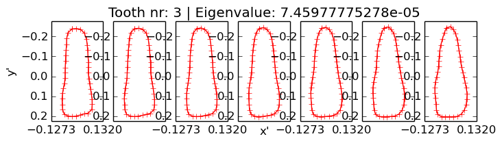

##### (reduced) model coordinate space tooth 4

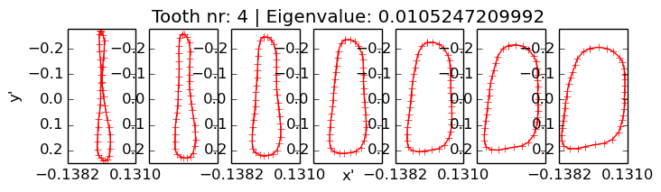
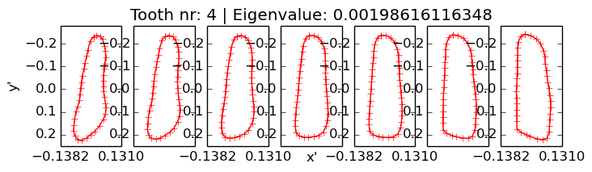
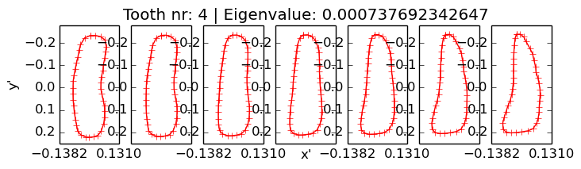

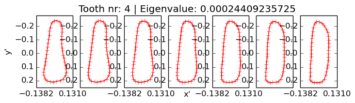
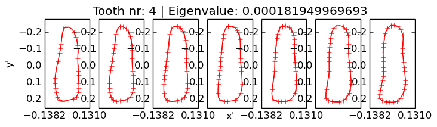

##### (reduced) model coordinate space tooth 5

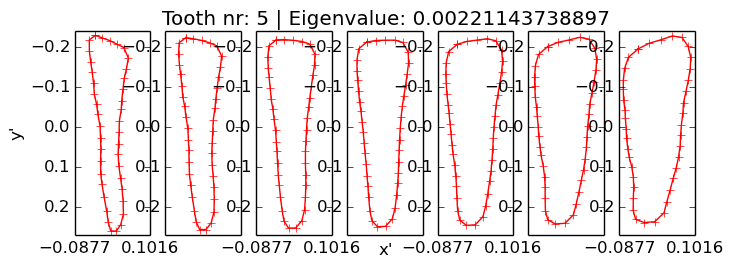
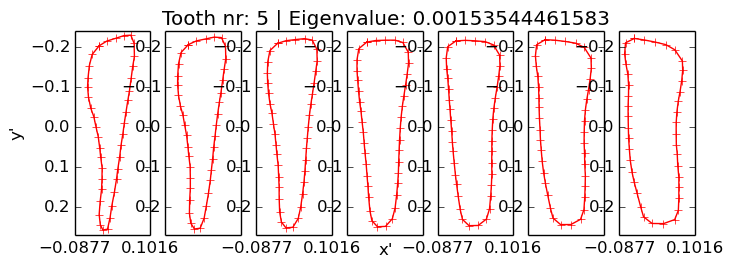
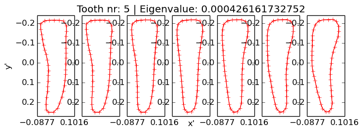

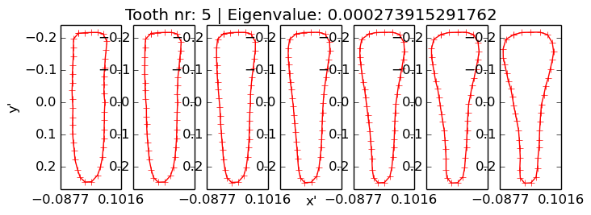
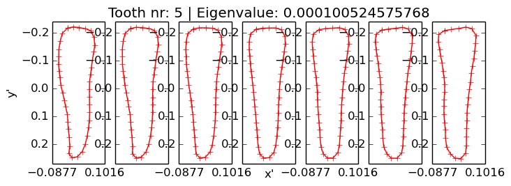
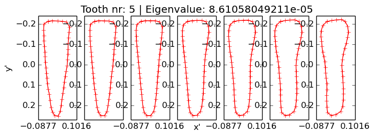

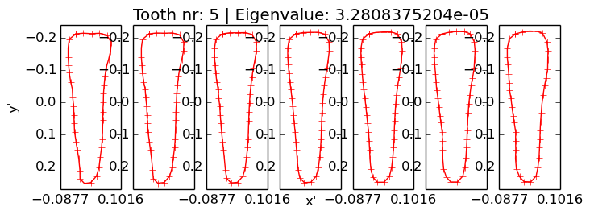

##### (reduced) model coordinate space tooth 6

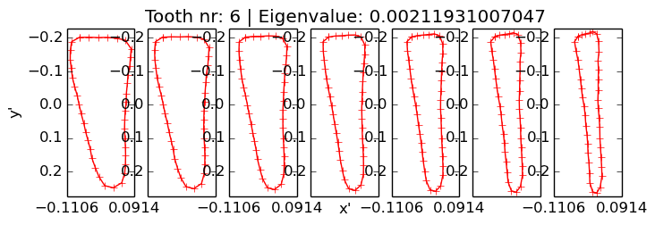
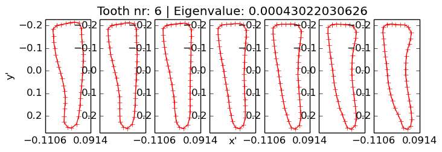
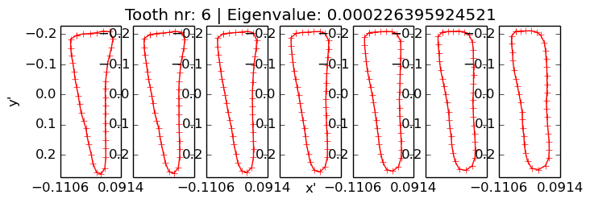

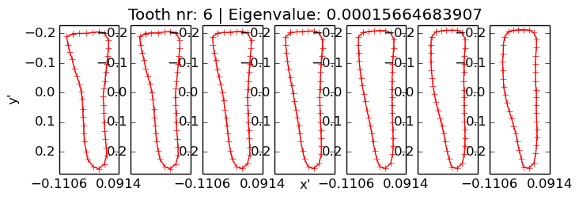
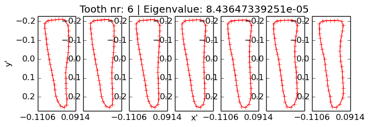
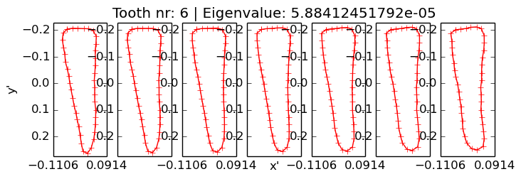

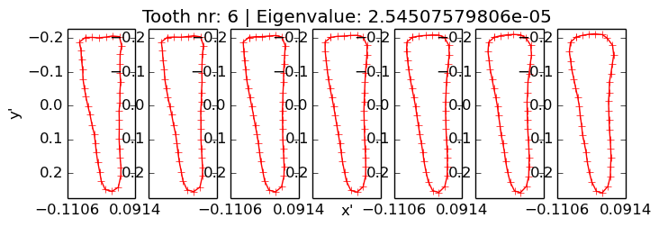

##### (reduced) model coordinate space tooth 7

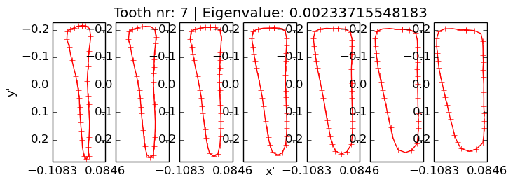

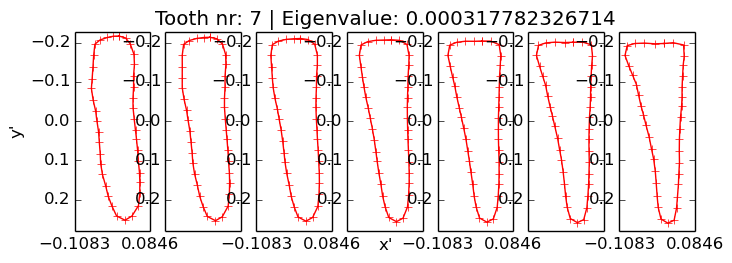

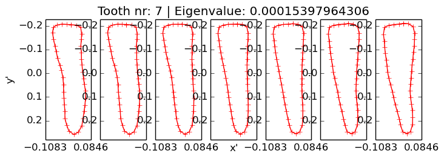
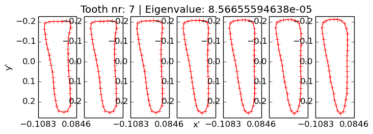


##### (reduced) model coordinate space tooth 8


### Pre-process
The region of the dental radiographs containing the eight incisor teeth is relatively small compared to the full dental radiographs. Therefore, we first crop the dental radiographs based on the minimal and maximal landmark coordinates (and an extra safety border) of all the landmarks of the training samples. This approach is justified since the appliances for generating dental radiographs centre the fore teeth, and since the appliances themselves are (approximately) standardized.

The given dental radiographs are inherently noisy data. We use `OpenCV`’s [`fastNlMeansDenoising`](https://docs.opencv.org/3.0-beta/modules/photo/doc/denoising.html) function to remove Gaussian white noise from the (greyscale) images.

Furthermore, the intensity differences can be sometimes rather small, which can have a negative impact on the fitting functions operating on the intensity differences. We exploit the contrast to increase the intensity differences by using two different approaches: histogram equalization and (linear) contrast stretching.

Equalization [[Fisher00](https://github.com/matt77hias/IncisorSegmentation/tree/master/meta/Extra%20Literature/Contrast%20Enhancement), OpenCV11] maps a distribution with histogram *H(x)* on another distribution with a larger and more uniform distribution of intensity values. The mapping is done with the cumulative distribution function *H'(x)* of the histogram *H(x)*.

Contrast stretching [[Fisher00](https://github.com/matt77hias/IncisorSegmentation/tree/master/meta/Extra%20Literature/Contrast%20Enhancement)] aims to improve the contrast of an image by stretching the range of intensity values *[c, d]* (linearly) over a target range of intensity values *[a, b]=[0, 255]*. Outliers in the original range can have a negative impact on *[c, d]* resulting in a not representative extent. Therefore, we set *[c, d]* to the 5th and 95th percentile of the histogram, respectively.

Some of our used pre-processing techniques are illustrated below. In the remainder, we always use the 14 training samples after cropping, denoising and (linear) contrast stretching, because these images give better results and convergence behaviour. We have not investigated this further.


1. Cropping (Original Greyscale)
2. Cropping -> Denoising
3. Cropping -> Histogram Equalization
4. Cropping -> Denoising -> Histogram Equalization
5. Cropping -> Linear Contrast Stretching
6. Cropping -> Denoising -> Linear Contrast Stretching

### Fitting
The first subsection describes the selection and construction of the fitting functions which will be used in the fitting procedures. The subsequent subsections explain the iterative single- and multi-resolution ASM fitting procedures, and the procedures for the manual and automatic generation of an initial solution for these iterative fitting procedures.

#### Construction of the fitting functions
To deform the shape of the initial solution and to converge to the incisor in image space, we use a fitting function. A fixed region around the landmarks is taken into account during each step of the iteration. The fitting function is used to find the best landmark inside this region.

If the landmarks are positioned on strong edges, we can search for the strongest edge in the neighbourhood. In general, however, we intend to learn from the training set to guide the searching in a given image. The model tooth is aligned with the sample tooth (i.e. current solution) in the image coordinate space to obtain a good approximation of the sample tooth. Next, *k* points on both sides of each model landmark (and the model landmark itself) are sampled in the image coordinate space in the direction of the profile normal with regard to the model edge (*1D Profile ASM*). To obtain a more robust (row) vector, **gi**, containing the sample values, which is not sensitive to global intensity differences, the intensity derivative (instead of the intensity values themselves) are sampled in the direction of the profile normal with regard to the model edge. The Mahalanobis distance of this normalized (row) vector, **gi**, using the Moore-Penrose pseudo inverse of the covariance matrix, becomes our fitting function. Altogether, 160 (= 8 tooth models times 20 landmarks/tooth model) fitting functions are constructed.  [[Cootes95](https://github.com/matt77hias/IncisorSegmentation/blob/master/meta/Literature/T.%20Cootes_Active%20Shape%20Models_Their%20Training%20and%20Application.pdf)], [[Cootes00](https://github.com/matt77hias/IncisorSegmentation/blob/master/meta/Literature/T.%20Cootes_An%20Introduction%20to%20Active%20Shape%20Models.pdf)], [[Pei10](https://github.com/matt77hias/IncisorSegmentation/blob/master/meta/Extra%20Literature/J.%20Pei_2D%20Statistical%20Models.pdf)]

We also considered fitting functions taking both the profile normal and tangent with regard to the model edge into account (*2D Profile ASM*). Altogether, 320 (= 2 times 8 tooth models times 20 landmarks/tooth model) fitting functions are constructed. Though, the results obtained with 2D Profile ASM are inferior to those obtained with 1D Profile ASM for our use case. Another alternative consists of sampling complete 2D texture patches around the model landmarks [[Pei10](https://github.com/matt77hias/IncisorSegmentation/blob/master/meta/Extra%20Literature/J.%20Pei_2D%20Statistical%20Models.pdf)].

Blue = model edge, Green = profile normal and tangent

#### Single-resolution Active Shape Model’s fitting procedure
Given an initial solution of an instance of a tooth model, we can iteratively fit this instance using the algorithm described by [[Cootes00](https://github.com/matt77hias/IncisorSegmentation/blob/master/meta/Literature/T.%20Cootes_An%20Introduction%20to%20Active%20Shape%20Models.pdf)]. In a fixed region around each landmark, *(Xi, Yi)*, we search for the best landmark, *(X’i, Y’i)*, according to our fitting function(s). *m* points (derivatives) on both sides of each model landmark (and the model landmark itself) are sampled in the image coordinate space in the direction of the profile normal with regard to the model edge. For each of the *2(m-k)+1* possible vectors, *gs*, of *2k+1* points (derivatives), we determine the quality by evaluating our preconstructed fitting functions, *f*. The point, *(X’i, Y’i)*, matching the middle component of the vector *gs*, that results in the lowest value of *f(gs)*, is considered as the new *i*th landmark.

After updating all landmarks, we determine the transformation parameters (2D translation, 1D scale and 1D rotation component) with regard to the model tooth in the model coordinate space and align the current tooth in the image coordinate space with the model tooth in the model coordinate space by computing all form factors, *bi*. Form factors, *bi*, larger than three standard deviations (*3 sqrt(γi)*) are corrected in order to avoid too large shape variations with regard to the model tooth. Next, the corrected tooth is transformed from model coordinate space back to image coordinate space. Convergence is reached and the algorithm is terminated if the current iteration does not result in significant changes in the transformation parameters or form factors. More concretely, the iteration terminates if 90% of the landmarks of the current iteration differ by at most one pixel from the corresponding landmarks of the previous iteration.

#### Multi-resolution Active Shape Model’s fitting procedure
In [[Cootes00](https://github.com/matt77hias/IncisorSegmentation/blob/master/meta/Literature/T.%20Cootes_An%20Introduction%20to%20Active%20Shape%20Models.pdf)] a new algorithm is introduced to increase the efficiency and robustness of the current algorithm using *multi-resolution search*. An instance is searched in multiple down-sampled versions of the original image by using the converged solution of the previous level as the initial solution of the current level.  By increasing the resolution, more fine details are introduced and taken into account into the fitting functions. For each image of the training set, a *Gaussian pyramid* (i.e. mip-map pyramid after applying a Gaussian filter) is constructed. The lowest level of this pyramid consists of the original image and each subsequent layer above consists of a smoothed and down-sampled image of the one below (containing a quarter of the texels). The Gaussian pyramids are constructed using `OpenCV`’s [`pyrDown`]( https://docs.opencv.org/2.4/doc/tutorials/imgproc/pyramids/pyramids.html).

The procedure is similar to a single-resolution search. Each time convergence or a fixed number of iterations is reached, the current solution is used as the initial solution on the next lower level of the Gaussian pyramid. For each level of the Gaussian pyramid, a separate set of fitting functions needs to be constructed. The higher the level, the larger the image regions that will be taken into account by the fitting functions. The values of *m* and *k* remain the same for all levels. During the search, it is possible to use larger and coarser (lower and more detailed) steps with regard to the current landmarks per iteration step at the higher (lower) levels. This multi-resolution search converges faster to a good solution (even in case of a bad initial solution) and is less likely to get stuck at a wrong structure (e.g. another neighbour tooth) in the image due to a combination of coarse and more-detailed steps.

##### Fitting iterations for level 2 of the Gaussian pyramid

Blue = mean model tooth, Red = solution after (appearance) fitting, Green = solution after (shape) correction

##### Fitting iterations for level 1 of the Gaussian pyramid

Blue = mean model tooth, Red = solution after (appearance) fitting, Green = solution after (shape) correction

##### Fitting iterations for level 0 of the Gaussian pyramid

Blue = mean model tooth, Red = solution after (appearance) fitting, Green = solution after (shape) correction

#### Initialisation
This section describes the process of finding an initial solution for the incisor before applying the fitting procedure (*single- or multi-resolution search*). In a first subsection a manual initialization procedure is described. A second subsection describes possible automatic initialization procedures.

##### Manuel initialization
By manually proposing an initial solution, the fitting algorithm can be tested independent of the initialization procedure. A user manually positions the forty landmarks around the chosen tooth using the mouse cursor. It is important that the manually positioned landmarks follow the same mapping as the training samples (i.e. starting at the top in counter clockwise direction). Furthermore, the positioned landmarks should be distributed as equidistantly separated as possible.

##### Automatic initialization
The purpose of the project is to design an algorithm for automatically segmenting the eight incisors. Therefore, a procedure needs to be designed for automatically determining an initial solution (close to the tooth to search for).

A first, possibly naive, approach consists of using the mean aligned model tooth in the image coordinate space. This shape is obtained by computing the mean transformation parameters to align the model tooth with all the training samples in the image coordinate space. This method is very sensitive for the scale and translation components of the training samples in the image coordinate space and thus does not always result in the desired outcome.

A second approach consists of computing the bounding boxes around the four upper and four lower incisors using *Haar cascade classifiers*. These classifiers are trained using both positive and negative samples obtained from the training set. More concretely, we use 13 variable positive and 30 fixed negative images. Furthermore, we use the tool `opencv_createsamples` for converting the positive images (i.e. text files containing the coordinates of the bounding boxes) to a compiled C++ VEC file. The negative samples are just the negative images themselves. These samples can be used to train our classifiers using `opencv_haartraining` (only Haar features) and `opencv_traincascade` ([Haar features](https://en.wikipedia.org/wiki/Haar-like_feature) and [Local Binary Patterns (LBP) features](https://en.wikipedia.org/wiki/Local_binary_patterns)). The latter is an improved version of the former, supporting besides the [Haar features](https://en.wikipedia.org/wiki/Haar-like_feature):
* [LBP features](https://en.wikipedia.org/wiki/Local_binary_patterns) for faster training and detecting depending on the training set at the possible expense of a less accurate detection;
* Multi-threading.

Since `opencv_haartraining` can take up to multiple days, we opted for `opencv_traincascade`. The output consists of an XML file containing our classifiers for detecting the bounding boxes around the upper and lower incisors. The obtained results are mostly rubbish due to the small set of positive and negative training samples used.

After the bounding box around the upper and lower incisors is detected, assuming an accurate positioning, the model tooth can be positioned in the centre of the corresponding quarter inside the bounding box and the fitting procedure can be started. Starting from the perfect bounding boxes, we notice some accurate fits. Furthermore, we deduce some strategies worth further investigations:
* Instead of centring the model tooth in the centre of the corresponding quarter inside the bounding box, it could be better to compute and use the average centring of the training samples with regard to the corresponding quarter inside the bounding box.
* Instead of scaling the model tooth using the average scaling of the models after transformation to the image coordinate space, it could be better to scale the model using the size of the corresponding quarter of the bounding box.
